# Entities Overview

The Entities Overview is your command center for all the important characters, NPCs, and items in your adventure.

## Entity Types and differences

There are three main types of entities:

|                | **Characters**                                   | **Locations**                                   | **Compendium**                                   |
|----------------|--------------------------------------------------|-------------------------------------------------|--------------------------------------------------|
| **Description** | Actors in your story, both protagonists and not | Places and maps where events occur           | Collections of items, lore, rulesets, sheets, and documents in general  |
| **Is Plot Node?** | Yes, Random Prompts invoke characters                | Yes, Random Prompts invoke locations                     | No, used for personal reference and lookup only                |
| **Exclusive Actions** | Can be used as "Speakers" for dialogue. PDFs extract single-page sheets. | PDFs extract single-page sheets.    | PDFs are loaded in their entirety, to allow using entire books and the PDF reader (see [PDF Reader Page](pdf-reader.md)). |

## Creating Entities

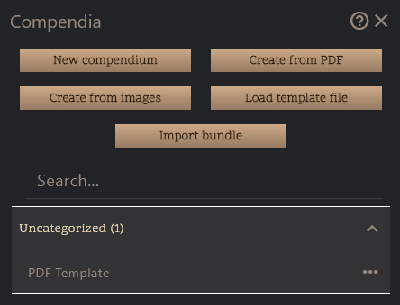

- **New Character/Location/Compendium**: Click the respective button to create a blank entity of that type.
- **Load template file (.pume)**: Import a previously exported entity template file to create a new entity pre-filled with the template's data.
- **Import bundle (.pumb)**: Import a bundle file containing multiple entities to add them all at once to your game.
- **Click/Search any template from the list**: Quickly create a new entity based on a predefined template, such as common character archetypes or location types.
- **Create from PDF (Compendiums-only)**: Import a PDF document to create a compendium entity using a PDF file as a reference, its cover image, and activate the PDF reader for it.
- **Create from images**: Create bulk entities through image files, each becoming the portrait of a new character or location. A separate popup allows configuring common Tags and Descriptions.
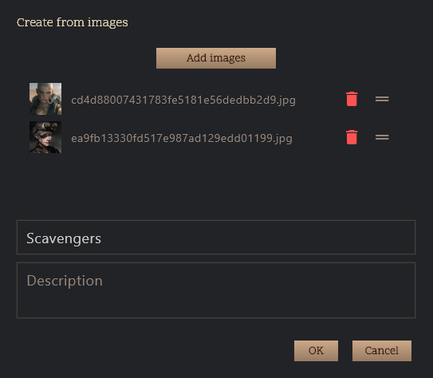

## Entity tab navigation basics

Entities are all characters, locations, and compendiums. You open them from the overview screen which shows all entities.

| 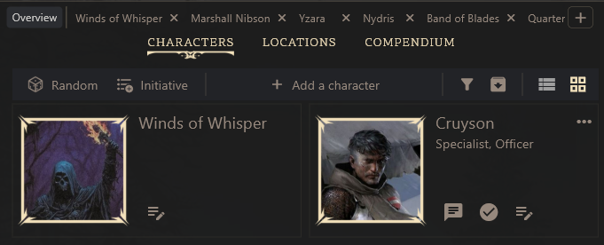 | 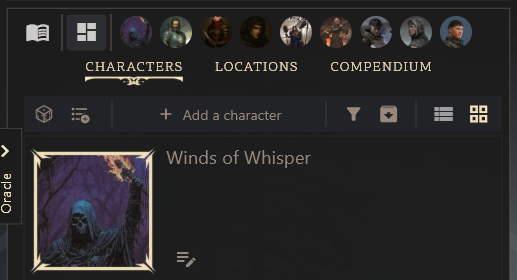 |
|---|---|
| Large screen (PC/Mac): full-width tabs with labels. | Small screen (mobile): compact icon-only tabs for small screens. |

Opening an entity will always open in a new tab within the entity panel area, and automatically switch to that tab.

You can switch between them using the tabs at the top of the entities panel.

### Entities Toolbar

To organize and manage your entities, the toolbar at the top of the entities panel provides various controls:

### Entities Layout and Rearrangement

The Grid overview allows rearranging the entities by press and hold to drag them into the desired order.

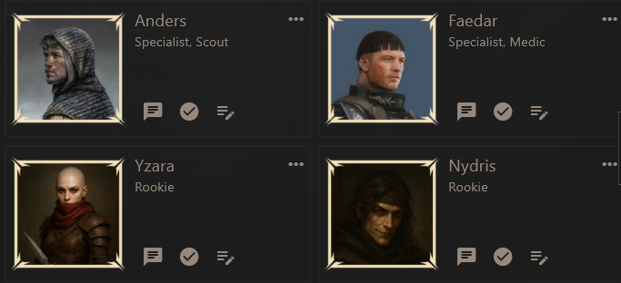

The List view might better fit small screen devices or large amount of entities, showing all entities in a vertical list.

Entities in the list view can be dragged using the extreme-right handle to rearrange their order.

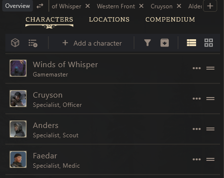

### Entity-level Actions

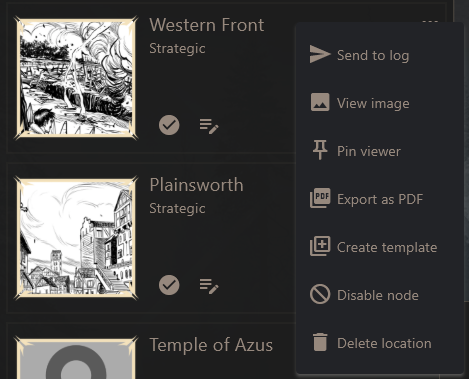

#### Quick-Access Buttons

- **Open entity**: Opens the entity details view by clicking the portrait image or the open sheet icon.
- **Speak as character** (characters only): Switches the composer to speak as this character.
- **Activate/Deactive node** (characters and locations only): Toggles whether this entity appears in Random Prompts and other plot-related features.
- **Add to Initiative** (when tracker visible, characters only): Adds this character to the initiative tracker for turn order management.

#### Menu Context Actions

- **Send to log**: Mentions the character in the journal log as a new entry. If cinematic mode is enabled, this will also show it on full screen overlay. Useful for "mentioning" characters in the story.
- **View images**: Opens the image viewer for this entity portrait image (just to "see it" larger).
- **Pin viewer**: Pins the main image of the entity as a floating overlay for quick access.
- **Export as PDF**: Exports the entity details as a PDF document for printing or sharing.
- **Create template**: Saves the current entity as a template for easy reuse when creating new entities.
- **Disable node**: Prevents this entity from appearing in Random Prompts, Random draws, and other plot-related features.
- **Delete entity**: Permanently removes this entity from your game. Use with caution!

### Initiative Tracker

The initiative tracker toggles a floating window that helps you manage turn order during combat, or even narrative (everybody gets to say or do something in some order).

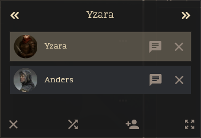

You can do the following:

- Use the arrow buttons to the top to move the turn forward or backward.
- Hold and rearrange characters in the initiative order by dragging them.
- Quicly open the entity by clicking their image portrait.
- Quickly speak on their behalf (if the tracker is wide enough to show the button).
- Remove characters from the initiative order by clicking the "X" button.
- Reshuffle the order randomly by clicking the shuffle icon.
- Add "temporary" characters to the initiative for unnamed NPCs, Monsters, etc.
- Resize the tracker window by dragging its bottom-right corner.

Once the initiative tracker is visible, characters in the overview will show an "Add to Initiative" button.

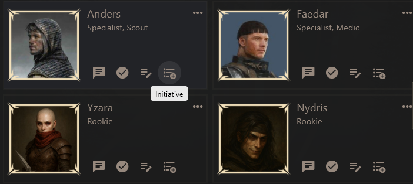

### Filter Entities

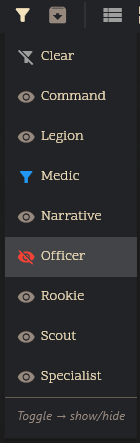

You can only show or hide specific entities by their Tags. You can manage tags in the [Entity Details View](#entity-details-view).

### Export bundle

You can export all **FILTERED** entities as a single bundle file (.pumb) for easy sharing with others, or as a backup of your current entity set. Pressing this button will open the file save dialog.

### Opening a blank entity tab

On large display layouts, you can open a new blank entity tab by clicking the "+" button to the right of the entity tabs.

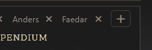

You can then set an entity for this tab manually.

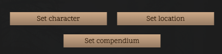

### Closing and Rearranging Entity Tabs

To close an entity tab, click the "X" button on the tab itself, or with the shortcut **Ctrl + W**. On mobile, you can press and hold the tab to reveal the menu with the close option.

You can rearrange the order of the entity tabs by right-clicking (desktop) or long-pressing (mobile) on a tab to open the context menu, then selecting "Rearrange Tabs". Drag and drop the tabs into your desired order. Right click or long-press in any entity tab, then click "Lock" to save the new arrangement.

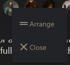

## Entity Details View

In this view you can configure the opened entity's details, including name, description, tags, images and sheets, and other journals about them.

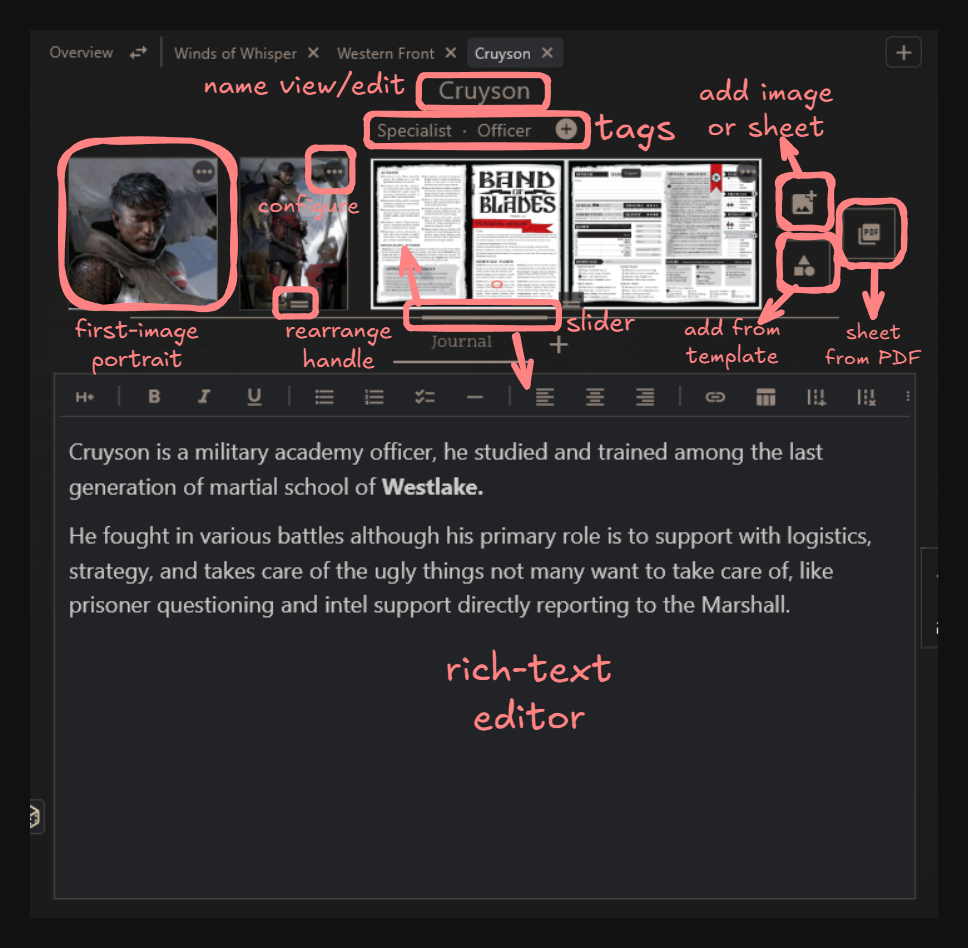

### Tags
Tags are keywords that help you categorize and filter entities. You can add multiple tags to an entity to make it easier to find later from different areas of the app. The autocomplete field will suggest existing tags as you type.

### Add image/sheet
You can add multiple images or sheets to an entity. Click the "Add Image/Sheet" button to upload images from your device. The first image will be used as the main portrait for the entity.

The images in an entity can serve double purpose:

- For Portraits and visual representation of the entity
- For Sheets that contain important information about the entity
- For Maps that can be referenced during gameplay
- For Visual Note-Taking within the entity context

**Secret tip**: Press and hold the "Add Image/Sheet" button to paste an image from your clipboard into the entity.

To learn more about using sheets and images, visit the [Entity Image Editor](entity-image-editor.md) page.

### Manage images/sheets

Opening the context menu on images offers several actions:

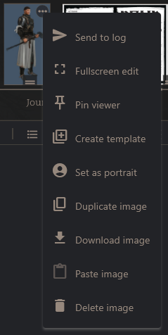

- **Send to log**: Mentions the image in the journal log as a new entry. If cinematic mode is enabled, this will also show it on full screen overlay. Important: the image in the log will be a copy, further edits will only affect the image in the log entry if done there. Editing the image in the entity will not update the log entry.
- **Fullscreen edit**: Opens the image in the Image Editor (see [Entity Image Editor](entity-image-editor.md) for more details).
- **Pin viewer**: Pins the image as a floating overlay for quick access.
- **Create template**: Saves the current image as a template for easy reuse when adding new images or sheets to entities.
- **Set as portrait**: Sets this image as the main portrait for the entity.
- **Duplicate image**: Creates a copy of this image within the entity.
- **Download image**: Saves the image to your device.
- **Paste image**: Pastes an image from your clipboard into the entity.
- **Delete image**: Permanently removes this image from the entity.

#### Pinned Floating Images

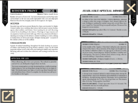

Pinned images appear as floating overlays that can be moved around the screen for quick reference during gameplay. You can pin multiple images at once, and they will stack neatly on the side of the screen, and you can move them around as needed.

- **Close pinned image**: Click the "X" button on the pinned image to close it.
- **Drag to move**: Click and drag the pinned image to reposition it on the screen.
- **Drag handle to resize**: Use the bottom-right corner handle to resize the pinned image.
- **Go to entity**: Click the image itself to open the entity details view where the image is located.
- **Click the image**: Opens the image in fullscreen mode for better viewing.

### Add from PDF (Characters and Locations)

Entities and locations allow adding image sheets from a PDF file. After selecting a PDF, a popup to help the user choose and preview the pages will appear.

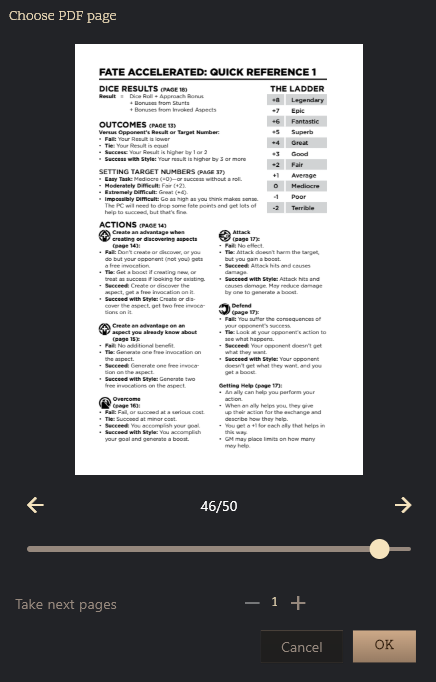

### Add PDF (Compendiums only)

For compendium entities, you can add an entire PDF document to serve as the main content of the compendium. This enables the PDF reader functionality for that entity. To learn more about the PDF Reader, visit the [PDF Reader Page](pdf-reader.md).

### Load template (image sheets)

Inside entities, images and sheets can become templates too, which are exported as type .pumi (PUM Image). You can load these templates into any entity to quickly add pre-configured images or sheets.

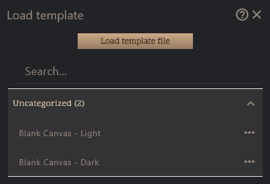

Image templates can be loaded from an exported file, or from the list of existing templates.

### Entity Journals

Entities can have their own journals, separate from the main log. These journals can be used to keep track of notes, background information, or any other relevant details about the entity. 

The player can create any number of journals for each entity, name them, and switch between them using the tabs at the top of the journal area.

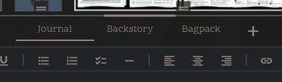

Press the "+" button to create a new journal for the entity. 

You can rename, rearrange, and delete journals by press-holding (mobile) or right-clicking (desktop) the journal tab to open the context menu.

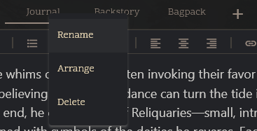