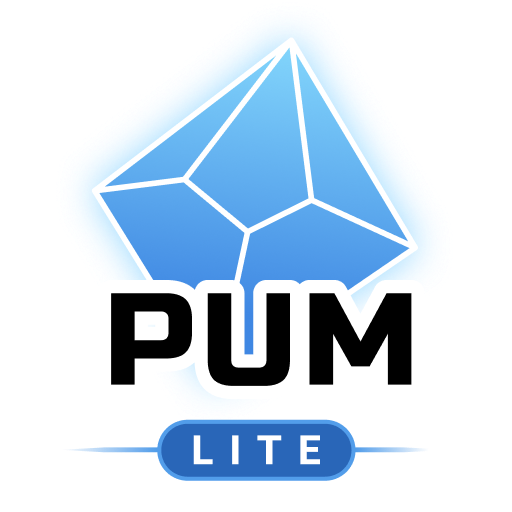

  
  

<h1 style="text-align: center;">PUM Companion &amp; PUM Lite</h1>

  This is the official knowledge base and support manual for <b>PUM Companion</b> and <b>PUM Lite</b>—the ultimate apps to play Solo RPG with the Plot Unfolding Machine. Here you’ll find everything you need to master the app with tabletop RPG setup, storytelling, and journaling, whether you’re a curious beginner or a seasoned solo adventurer.

  <a href="rules-core-loop/" class="md-button md-button--primary" style="font-weight: bold; margin-right: 10px;">📖 PUM Quick Rules (Free)</a>
  <a href="pum-lite/" class="md-button" style="margin-right: 10px;">📱 PUM Lite (Free App)</a>
  <a href="pum-companion/" class="md-button">💎 PUM Companion (Full App)</a>

  <ul style="list-style: none; margin: 0 auto; padding: 0; display: inline-block; text-align: left;">
    <li style="margin: 0; padding: 0;">💬 <a href="https://discord.gg/k2rQMa33Kq">Join the PUM Discord Community</a></li>
    <li style="margin: 0; padding: 0;">🚀 <a href="https://github.com/Unfolding-Machines/pumc-online-hub">Improve the Online Manual on GitHub</a></li>
    <li style="margin: 0; padding: 0;">🌐 <a href="https://www.unfolding-machines.com">Unfolding Machines Website &amp; Blog</a></li>
  </ul>

  <h3>📬 Direct Support &amp; Contact</h3>
  

    For help, questions, bug reports, or feedback regarding <b>PUM Lite</b> or <b>PUM Companion</b>, reach out on Discord for the fastest response, or email me directly:
  

  

    💬 <a href="https://discord.gg/k2rQMa33Kq">PUM Discord Community</a>
  

  

    📧 <a href="mailto:jeansenvaars@disroot.org">jeansenvaars@disroot.org</a>
  

  

---

## Community & Contributions

This page has been setup for the PUM community. Everyone is welcome to contribute improvements to it, so feel free to submit tips, random tables, hacks, and stories. If you have questions, suggestions, or need direct support, please email me at <a href="mailto:jeansenvaars@disroot.org">jeansenvaars@disroot.org</a>, join us on Discord, or submit a Pull Request contribution to the [GitHub repository](https://github.com/Unfolding-Machines/pumc-online-hub/).

**Happy storytelling!**

---

  

*PUM Companion and PUM Lite are powered by the Plot, Scene, and Game Unfolding Machine games. Unfolding Machines @ Copyright 2024*