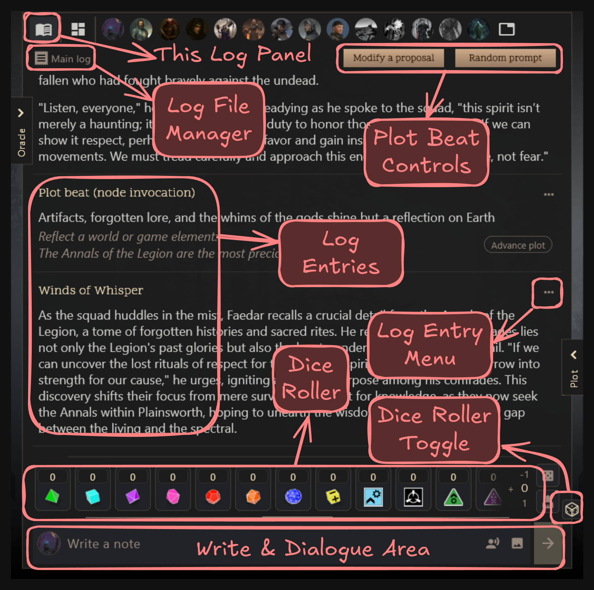
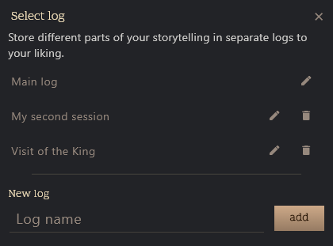
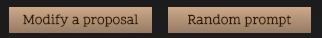
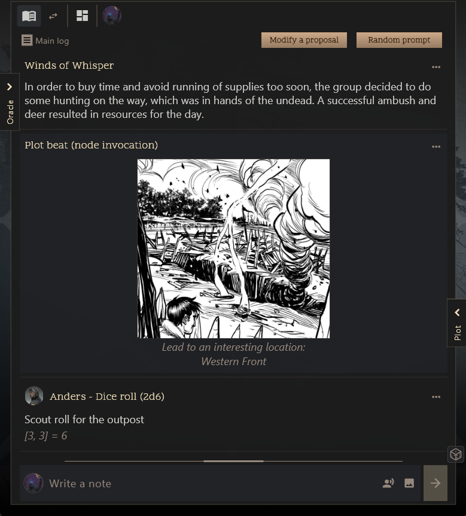
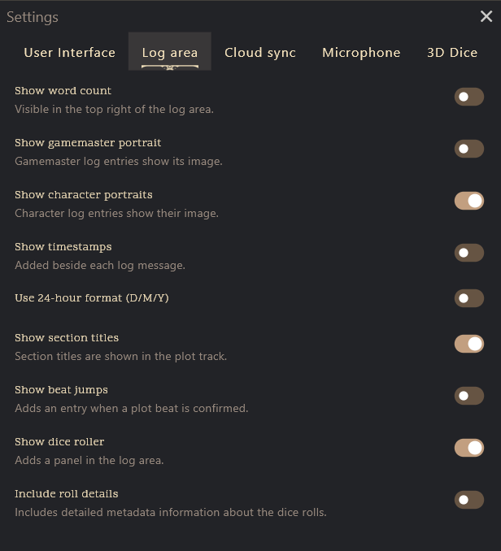
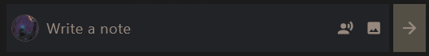
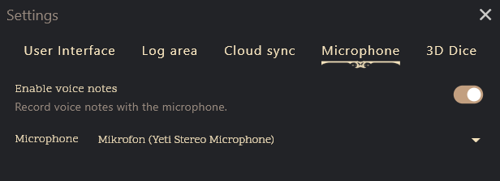

# Log Panel

The Log Panel is your adventure’s living journal. Write your descriptions and dialogue. Play results, oracle answers, dice rolls, add images and audio notes, and draw cards all land here in a scrollable timeline so you can replay, edit, or react to anything that happened during your session.



## Log File Manager
- Tap the header badge (the receipt icon + log name) to open the log selector dialog. Pick any log, rename it, delete an unused one, or add a fresh log so different scenes or campaigns stay organized.
- The dialog lists every log file, highlights the Main Log, and lets you rename, remove, or create logs without losing existing entries. Empty log slots show up immediately after creation.



To create a new log file, write a New log name and press "add". To switch to a different log file, just tap its name in the list.
To edit a log's name, tap the pencil icon beside it, change the name, and press "edit".

Considerations:

- Each game has one Main Log that can’t be deleted.
- Logs that contain plot beat advancements can’t be deleted to avoid losing story progress (you may undo the advancements first if needed).
- Organize the logs under your own naming scheme (e.g., by session date, scene name, or chapter, important event, world building, etc.).

## Playing Plot Beats (Random Prompts and Modified Proposals)
The app is conveniently setup to play Plot Unfolding Machine with ease, and the log panel has built-in buttons to help you generate story prompts and modified proposals on the fly.



Modified proposals invoke alterations to the current plot beat based on your input, while random prompts invoke a fresh prompt for you to draw inspiration from. Random prompts invoke Plot Nodes which you manage in the Plot Nodes panel (go to: [Plot Nodes](plot-nodes.md) to learn more).

Generated Plot Beats are added to the log as entries with a special highlight and an "Advance" button. When you confirm that a plot beat has occurred in your story, tap "Advance" to promote it to the active plot track. This helps keep your story organized and ensures that your plot progresses smoothly (go to: [Plot Tracks](plot-tracks.md) to learn more).

## Log area and log entries

The log area displays all entries in chronological order. Each entry can contain text, images, audio notes, dice rolls, oracle answers, and card draws.



Interacting with log entries can be done through the three-dot menu or by long-pressing on the entry (on touch devices). This opens a context menu with various actions you can perform on the entry:

- **View**: Opens the entry in Visual Cinematic Mode for replaying text and examining attached media.
- **Pin Viewer/Cards** (with images): Pins images or card stacks to the board as overlays for quick access.
- **Insert**: Adds a new blank entry after the selected one and begins editing automatically.
- **Copy**: Copies the entry's content for pasting elsewhere.
- **Edit**: Switches the composer into edit mode for that entry.
- **Describe** (for oracle/dice rolls): edit mode for adding additional context or description.
- **Reroll** (if random entry): Re-invokes the original oracle or dice roll.
- **Download** (with media): Saves attached audio or image files to disk.
- **Delete** (if allowed): Removes the entry entirely.
- **Advance** (for plot beats): Promotes a user text entry as a confirmed plot beat.

Theere may also be section titles which are fixed:


This can be toggled with the Log Setting "Show section titles".

## Log Area Settings

There are several settings to customize the log area experience. Access these settings by clicking the hamburger menu in the top-right corner of the screen, settings, then "Log area" tab.



1. **Show Word Count** – Displays live word counts for the entire journal written by the player. It only counts the text part of entries, i.e. not the text generated from dice rolls, random tables, or oracle answers.
2. **Show GM Portrait** – Displays the GM avatar alongside game-master entries.
3. **Show Character Portraits** – Shows character portraits by each entry when available.
4. **Show Timestamps** – Adds timestamps to each entry in the timeline.
5. **Use 24h Timestamp** – Switches timestamps between 12h and 24h format.
6. **Show Section Titles** – Displays section headings when the plot track inserts them.
7. **Confirmed Plot Beats** – Shows/hides the “Advance” cue that promotes relevant entries.
8. **Show Dice Roller** – Toggles the roller widget below the timeline.
9. **Include Roll Details** – Appends formulas and dice details to each dice-roll entry when enabled.

## Entry Writing and Editing (input)



This is where you write new, edit existing, and submit log entries. It supports basic **Markdown** formatting for text styling:

| Feature                | Markdown Example                      | Keyboard Shortcut        |
|------------------------|---------------------------------------|-------------------------|
| **Bold**               | `**bold text**`                       | Ctrl+B / Cmd+B          |
| *Italic*               | `*italic text*`                       | Ctrl+I / Cmd+I          |
| Header 1               | `# Heading 1`                         | N/A                  |
| Header 2               | `## Heading 2`                        | N/A                  |
| Header 3               | `### Heading 3`                       | N/A                  |
| Left-aligned Header 2  | `##l A new Day`                       | N/A                     |
| Bullet List            | `- Item one`<br>`- Item two`          | Press enter to auto-add new item            |
| Number List            | `1. First`<br>`2. Second`             | Press enter to auto-add next number            |
| Code Line              | `` `inline code` ``                   | N/A                  |
| Code Block             | <pre>```multi-line text paragraph```</pre> | N/A            |

### Speaker/Microphone Button

**Microphone Input Disabled**

For video streamers who wish to "show" who is speaking, press and hold this button to visually show the portrait of the speaker character over the screen until you release. It does not do anything to the log entry itself.

**Microphone Input Enabled**

The speaker button will become a microphone button. Press and hold to record audio input for the log entry. Release to stop recording and attach the audio clip to the entry.

To enable voice notes, go to Settings → Microphone Input and toggle it on, then choose your preferred input device.



## Dice Roller
Enable the Dice Roller by clicking the floating dice icon at the bottom right of the log panel.

If you have 3D Dice Extra enabled (go to: [3D Dice Customization](custom-3d-dice.md) to learn more), you will see the enhanced roller with 3D dice icons, and if imported, any custom dice you have added. You may scroll horizontally to see all available dice types.
